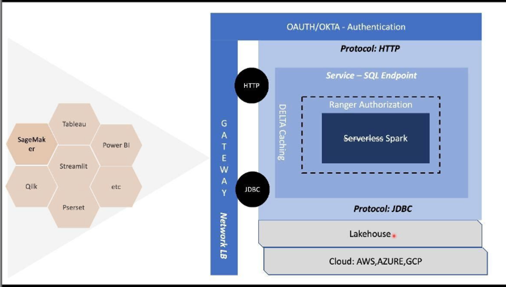

# Smart Analytics

Every body talks about Data engineering is software problem. That's ture. In the world of software, application are 
built using APIs first approach, that is, micro-services  based architecture combined with micro-front end architecture.
Micro-frontends are intended to bring the same benefits of microservices to the UI layer. By breaking up a complex 
system into smaller, more manageable pieces, teams can rapidly develop and release new features and functionality with
agility & end to end automation - software excellence. This style of application development is referred to as
[12-factor-app](https://12factor.net)

Micro-frontends architecture really shine in project with many of developers working together in a large business domain 
and with a goal to reduce the complexity by dividing into multiple subdomains, independently deploy different parts of 
the applications without creating communication and coordination overhead across teams. 

> _micro-service + micro-frontend = agility & end to automation = simplicity_


The analytics is all about finding answers to a question using data, also called **_data product with interactive 
visualization_**. Multiple team make data product and visualization teams using this data product provides visualization.
This visualization provides insight into the business.

Visualization is at the heart of data analysis. The engineers of data visualization applications are choosing 
between two options:

- No-code BI visualization tools, with a drag-n-drop interface and some possible extensions for customization, e.g. Tableau
- Web frameworks with rich visualization capabilities in high-level programming languages, such as JS, Python etc

We are living in the world of interactive visualization, with the rise of framework like Dash and Streamlit, building 
visualization using Python (programing language of choice for the data teams), is becoming very attractive option.


> So analytics world is on the same cross-roads as application team were.

How can we make analytics development simpler, automated and thereby empowering the engineering teams.

> Hold on: Isn't it micro-services + micro-front architecture provide this.

The question arises, how can we convert data product as a service, so that micro-frontends can be build. These 
micro-front can be:
- traditional, eg tableau, powerBI
- modern UI, eg reactJS, Streamlit 

This blog demonstrates, Data Product As Service using Databricks [SQL endpoint](https://databricks.com/product/databricks-sql) and analytics visualization using 
Streamlit


Topics/Agenda
=================

 * [Architecture](#Architecture)
 * [Prerequisites](#Prerequisites)
 * [Demo](#Demo)
 * [Setup](#Setup)
 
## Architecture

Following picture shows the reference architecture for building analytics using micro-services + micro-frontend 
architecture - *_termed as "Smart Analytics"_*


The above architecture is composed of the following:

- **_Data Product_**
  
  A "Data Product" typical lives in a data lake/lakehouse and storge is typically
  object storage (AWS - S3 bucket). In Databricks, it's stored as Delta table on 
  delta lake.
  

- **_Data Product As Service_**
  
  This demonstration uses Deltalake/Databricks extensively, as a result, making data product **_as a service_**, is achieved using 
  Databricks SQL Endpoint. Wrapping Data Product As Service, helps in providing horizontal
  concerns like authentication (e.g. OAUTH/OKTA), authorization (e.g. [Ranger](https://github.com/mgorav/ranger-policies)) 
  
  Databricks provide ability to access data product using SQL endpoint, agnostic of the underlying protocol, as shown 
  in the configuration below:
  
  Further, using SQL Endpoint, it's possible on one hand possible to connect with traditional visualization tools like 
  Tableau, PowerBI, Arcion, Fivetran, Infoworks, Qlik, Rivery, Stitch, StreamSets, Syncsort etc or custom UI using 
  Streamlit or Dash

- **_Micro-frontend_**
  The final component of the reference architecture - visualization using **_"micro-frontend architecture"_**. This in 
  simple terminology means injecting traditional visualization and custom-built UI in the browser, as shown below:
  

> What is Micro Frontend?
> - developing frontend using micro-services architecture principles
> - think micro-frontend application as composition of different capabilities (cross functional teams)
> - domain driven design development in action
> 


## Prerequisites

- [Databricks SQL endpoint](https://databricks.com/product/databricks-sql)
  The demo using New York yellow taxi data
- Free [Mapbox](https://www.mapbox.com/) token  - accessible token [here](https://www.mapbox.com/)
- Locally: Docker, Makefile
- [New York taxi dataset](https://www1.nyc.gov/site/tlc/about/tlc-trip-record-data.page)
- Since this application uses [DockerFile](https://raw.githubusercontent.com/mgorav/data-product-as-service/main/Dockerfile),
  this application can be deployed as serverless containerization tech like Fargate or [OAM](https://oam.dev) like [DAPR](https://dapr.io/)
- [Streamlit](https://streamlit.io/)

## Demo


> NOTE: Use [mp4](https://github.com/mgorav/data-product-as-service/blob/main/SmartAnalyticsApp.mp4) demo for better visual experience

## Setup 

1. Create or start an existing DBX SQL endpoint in the workspace
2. Create a query and define the database and table (Data Product):

```sql
CREATE TABLE IF NOT EXISTS default.nyctaxi_yellow 
USING DELTA
LOCATION "dbfs:/databricks-datasets/nyctaxi/tables/nyctaxi_yellow";
```

3. Change`.env` file as per your configuration 
4. Substitute right values in .env file
5. On local machine, launch `make docker-run` to launch the server
6. Open http://localhost:9999 and it's time to play :) 
7. For DAPR
> Install DAPR locally or on k8s/EKS
````
dapr run --app-id smartapp --app-port 9999 --dapr-http-port 9999 python app.py
````

> **_NOTE_** Following micro-frontend integraiton techniques can be used:
> 
> Routing
> 
> iFrame
> 
> Micro-apps
> 
> Pure components
> 
> Web components


> **_NOTE:_** Micro-frontend architecture worth looking:
> 
> Bit
> 
> Module Federation
> 
> Single SPA
> 
> SystemJS
> 
> Piral


## Summarization

I feel at the end of my research journey, I can confidently says, **_"yes indeed, data engineering is a software problem"_**. All design 
principles of software applies to data. Such architecture styles by providing software excellence, aides in automation & 
simplicity. I wonder which company can say NO. It's time we say goodbye to 90s analytics style and say hello to 2022 analytics style :-)

Finally, using aforementioned architecture, it's possible to mix and match different analytics tools like shown below:




## Linkedin 

> How to move from "Report building department" to "Smart Analytics application (browser based) building department"?

Everybody/analysts talks about data handling as software problem. The question arises, if it's a software problem, how can, we:
- implement APIs/Service first approach (protocol agnostic data product access)
- implement micro-services architecture
- utilize micro-frontend/modular UI
- implement serverless/containerization - fuel for automation
- use OAM (Open Application Model Specification) like DAPR (Distributed Application Runtime)
- have unified batch and stream programming model (simplification)
- access SQL as endpoint fueled by power of cloud
- be agnostic of power behind SQL execution (Apache Spark)
- secure and authorized data access (privacy@core)
- etc

These are over the years, battle/production hardened software development practices and not buzz words. I call for breaking this bridge - application vs analytics and stop burning companies money (double investment)

Data in itself has no value, adding a smart analytics help in providing “data story telling”. Aforementioned style of architecture not only help in agility, but also provides scale with automation & simplicity. This architecture style is an ace, and can be combined with traditional analytics tools like Tableau, Oracle analytics etc, as well as modern analytics style using Redash, Streamlit etc

There are many usecases, some from retail industry:
- sales
- logistics
- inventory
-….

From health insurance, following usecases pops out:
- policies
- claim admin
- product definition with sample claim processing
- ….

From payment industry, following usecases comes to mind:
- retailer
- payments tracking
- payment products
- multi-channel payment activity
- merchant
-….

90’s era was all about analytics in a box (monolithic). It's time, we say goodbye to 90s analytics style and say hello to 2022 analytics style :-)

This style brings same old power of SQL in your hand and augment it with the power of cloud, accessible as a service - termed cloud native analytics.

The key to building such "Smart Analytics aka Cloud Native Analytics" (breaking the bridge) lies in making "Data Product As Service". A service, which is agnostic of underlying protocol.

Checkout my blog, which demonstrates such concepts using Databricks SQL Endpoint and real-time geo location tracking, just like Ubers of the world. This in my humble opinion - data at finger tip or just a service call away.

Architects/Engineers, software/data professionals, POs etc - Be the change you want to see in the world of advance analytics. (inspiration from Mahatma Gandhi famous quote ) 

PS: This example is adapted from DBX sample

